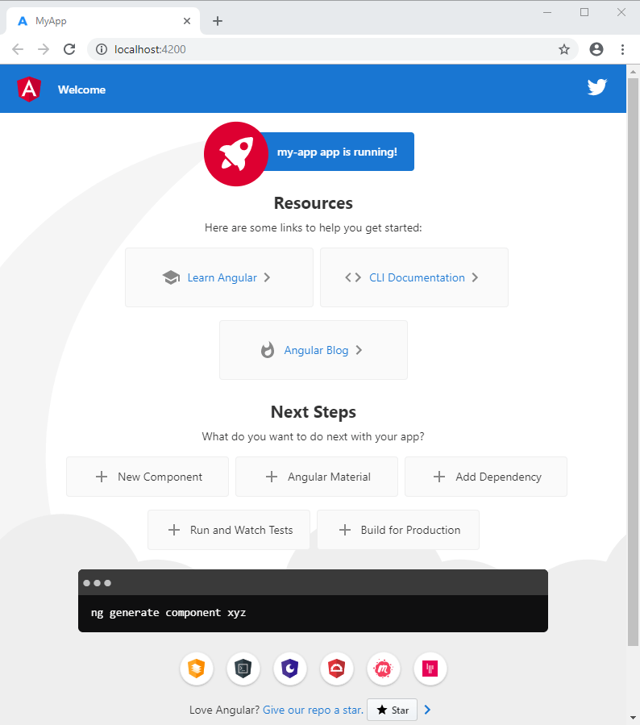

## Table of Contents
- [What is Angular?](#what-is-angular?)
- [History and versions](#history-and-versions)
- [Getting started with Angular
](#getting-started-with-angular)
- [Working Environment Configuration](#getting-started-with-angular)

### What is Angular?

Is a java script framework to develop SPA(Single Page Applications).

- A component-based framework for building scalable web applications
- A collection of well-integrated libraries that cover a wide variety of features, including routing, forms management, client-server communication, and more
- A suite of developer tools to help you develop, build, test, and update your code


### History and Versions


The first version of Angular was released 2010 and that’s called AngularJs.

The second version was released 2016 called Angular 2 and then, they continuously released new versions in each 6 month with lots performance improvements and bug fixes. Now the new version is 15….


### Getting started with Angular

To understand the capabilities of the Angular framework, we need to learn about the following:
- Components
- Templates
- Directives
- Dependency injection


#### Components
Components are the main building block for Angular applications. Each component consists of:

- An HTML template that declares what renders on the page
- A TypeScript class that defines behavior
- A CSS selector that defines how the component is used in a template
Optionally, CSS styles applied to the template


The following is a minimal Angular component.

```
import { Component } from '@angular/core';

@Component({
  selector: 'hello-world',
  template: `
    <h2>Hello World</h2>
    <p>This is my first component!</p>
  `
})
export class HelloWorldComponent {
  // The code in this class drives the component's behavior.
}
```

To use this component, you write the following in a template:

```js
<hello-world></hello-world>
```

When Angular renders this component, the resulting DOM looks like this:

```
<hello-world>
    <h2>Hello World</h2>
    <p>This is my first component!</p>
</hello-world>
```


###### Lifecycle hooks
A component instance has a lifecycle that starts when Angular instantiates the component class and renders the component view along with its child views. The lifecycle continues with change detection, as Angular checks to see when data-bound properties change, and updates both the view and the component instance as needed. The lifecycle ends when Angular destroys the component instance and removes its rendered template from the DOM. Directives have a similar lifecycle, as Angular creates, updates, and destroys instances in the course of execution.

###### View encapsulation
In Angular, a component's styles can be encapsulated within the component's host element so that they don't affect the rest of the application.

###### Pass data from parent to child with input binding
```
import { Component, Input } from '@angular/core';

import { Hero } from './hero';

@Component({
  selector: 'app-hero-child',
  template: `
    <h3>{{hero.name}} says:</h3>
    <p>I, {{hero.name}}, am at your service, {{masterName}}.</p>
  `
})
export class HeroChildComponent {
  @Input() hero!: Hero;
  @Input('master') masterName = '';
}
```
The second @Input aliases the child component property name masterName as 'master'.

```
import { Component } from '@angular/core';

import { HEROES } from './hero';

@Component({
  selector: 'app-hero-parent',
  template: `
    <h2>{{master}} controls {{heroes.length}} heroes</h2>

    <app-hero-child
      *ngFor="let hero of heroes"
      [hero]="hero"
      [master]="master">
    </app-hero-child>
  `
})
export class HeroParentComponent {
  heroes = HEROES;
  master = 'Master';
}
```
###### Component styles
Angular applications are styled with standard CSS. That means you can apply everything you know about CSS stylesheets, selectors, rules, and media queries directly to Angular applications.

Additionally, Angular can bundle component styles with components, enabling a more modular design than regular stylesheets.
- Using component styles

For every Angular component you write, you can define not only an HTML template, but also the CSS styles that go with that template, specifying any selectors, rules, and media queries that you need.

One way to do this is to set the styles property in the component metadata. The styles property takes an array of strings that contain CSS code. Usually you give it one string, as in the following example:
```
@Component({
  selector: 'app-root',
  template: `
    <h1>Tour of Heroes</h1>
    <app-hero-main [hero]="hero"></app-hero-main>
  `,
  styles: ['h1 { font-weight: normal; }']
})
export class HeroAppComponent {
/* . . . */
}
```

###### Sharing data between child and parent directives and components

A common pattern in Angular is sharing data between a parent component and one or more child components. Implement this pattern with the @Input() and @Output() decorators.

###### Content projection
Content projection is a pattern in which you insert, or project, the content you want to use inside another component. For example, you could have a Card component that accepts content provided by another component.

- Single-slot content projection
The most basic form of content projection is single-slot content projection. Single-slot content projection refers to creating a component into which you can project one component.

For example, the following component uses an <ng-content> element to display a message.

```
import { Component } from '@angular/core';

@Component({
  selector: 'app-zippy-basic',
  template: `
    <h2>Single-slot content projection</h2>
    <ng-content></ng-content>
  `
})
export class ZippyBasicComponent {}
```

With the <ng-content> element in place, users of this component can now project their own message into the component. For example:
```
<app-zippy-basic>
  <p>Is content projection cool?</p>
</app-zippy-basic>
```

- Multi-slot content projection

A component can have multiple slots. Each slot can specify a CSS selector that determines which content goes into that slot. This pattern is referred to as multi-slot content projection. With this pattern, you must specify where you want the projected content to appear. You accomplish this task by using the select attribute of <ng-content>.

Add a select attribute to the <ng-content> elements. Angular supports selectors for any combination of tag name, attribute, CSS class, and the :not pseudo-class.
For example, the following component uses two <ng-content> elements.

```
import { Component } from '@angular/core';

@Component({
  selector: 'app-zippy-multislot',
  template: `
    <h2>Multi-slot content projection</h2>

    Default:
    <ng-content></ng-content>

    Question:
    <ng-content select="[question]"></ng-content>
  `
})
export class ZippyMultislotComponent {}
```

Content that uses the question attribute is projected into the <ng-content> element with the select=[question] attribute.
```
<app-zippy-multislot>
  <p question>
    Is content projection cool?
  </p>
  <p>Let's learn about content projection!</p>
</app-zippy-multislot>
```

#### Templates
Every component has an HTML template that declares how that component renders. You define this template either inline or by file path.

###### Prerequisites
Before learning template syntax, you should be familiar with the following:

- Angular concepts
- JavaScript
- HTML
- CSS

Angular adds syntax elements that extend HTML so you can insert dynamic values from your component. Angular automatically updates the rendered DOM when your component's state changes. One application of this feature is inserting dynamic text, as shown in the following example.

```
<p>{{ message }}</p>
```
The value for message comes from the component class:

```
import { Component } from '@angular/core';

@Component ({
  selector: 'hello-world-interpolation',
  templateUrl: './hello-world-interpolation.component.html'
})
export class HelloWorldInterpolationComponent {
    message = 'Hello, World!';
}
```
When the application loads the component and its template, the user sees the following:
```
<p>Hello, World!</p>
```

Notice the use of double curly braces—they instruct Angular to interpolate the contents within them.

Angular also supports property bindings, to help you set values for properties and attributes of HTML elements and pass values to your application's presentation logic.

```
<p
  [id]="sayHelloId"
  [style.color]="fontColor">
  You can set my color in the component!
</p>
```

Notice the use of the square brackets—that syntax indicates that you're binding the property or attribute to a value in the component class.

Declare event listeners to listen for and respond to user actions such as keystrokes, mouse movements, clicks, and touches. You declare an event listener by specifying the event name in parentheses:

```
<button
  type="button"
  [disabled]="canClick"
  (click)="sayMessage()">
  Trigger alert message
</button>
```
The preceding example calls a method, which is defined in the component class:

```
sayMessage() {
  alert(this.message);
}
```
The following is a combined example of Interpolation, Property Binding, and Event Binding within an Angular template:

```
import { Component } from '@angular/core';

@Component ({
  selector: 'hello-world-bindings',
  templateUrl: './hello-world-bindings.component.html'
})
export class HelloWorldBindingsComponent {
  fontColor = 'blue';
  sayHelloId = 1;
  canClick = false;
  message = 'Hello, World';

  sayMessage() {
    alert(this.message);
  }
}
```
```
<button
  type="button"
  [disabled]="canClick"
  (click)="sayMessage()">
  Trigger alert message
</button>

<p
  [id]="sayHelloId"
  [style.color]="fontColor">
  You can set my color in the component!
</p>

<p>My color is {{ fontColor }}</p>
```
- Displaying values with interpolation

Interpolation refers to embedding expressions into marked up text. By default, interpolation uses the double curly braces {{ and }} as delimiters.

To illustrate how interpolation works, consider an Angular component that contains a currentCustomer variable:

```
currentCustomer = 'Maria';
```

Use interpolation to display the value of this variable in the corresponding component template:

```
<h3>Current customer: {{ currentCustomer }}</h3>
```

Angular replaces currentCustomer with the string value of the corresponding component property. In this case, the value is Maria.

In the following example, Angular evaluates the title and itemImageUrl properties to display some title text and an image.

```
<p>{{title}}</p>
<div></div>
```
 - Template statements
 Template statements are methods or properties that you can use in your HTML to respond to user events. With template statements, your application can engage users through actions such as displaying dynamic content or submitting forms.

 ```
 <button type="button" (click)="deleteHero()">Delete hero</button>
 ```

 - Understanding binding
 In an Angular template, a binding creates a live connection between a part of the UI created from a template (a DOM element, directive, or component) and the model (the component instance to which the template belongs). This connection can be used to synchronize the view with the model, to notify the model when an event or user action takes place in the view, or both. Angular's Change Detection algorithm is responsible for keeping the view and the model in sync.

Examples of binding include:

  - text interpolations
  - property binding
  - event binding
  - two-way binding

Bindings always have two parts: a target which will receive the bound value, and a template expression which produces a value from the model.

- Attribute binding
Attribute binding in Angular helps you set values for attributes directly. With attribute binding, you can improve accessibility, style your application dynamically, and manage multiple CSS classes or styles simultaneously.

```
<p [attr.attribute-you-are-targeting]="expression"></p>
eg: <button type="button" [attr.aria-label]="actionName">{{actionName}} with Aria</button>

<!--  expression calculates colspan=2 -->
<tr><td [attr.colspan]="1 + 1">One-Two</td></tr>
```
- Class and style binding
To create a single class binding, type the following:
```
[class.sale]="onSale"
```
- Binding to multiple CSS classes
```
[class]="classExpression"
```

- Event binding
Event binding lets you listen for and respond to user actions such as keystrokes, mouse movements, clicks, and touches.

Create the following example; the target event name is click and the template statement is onSave().

```
<button (click)="onSave()">Save</button>
```
- Property binding
Property binding in Angular helps you set values for properties of HTML elements or directives. Use property binding to do things such as toggle button features, set paths programmatically, and share values between components.

```

```
```
itemImageUrl = '../assets/phone.png';
```

- Two-way binding
Two-way binding gives components in your application a way to share data. Use two-way binding to listen for events and update values simultaneously between parent and child components.

Angular's two-way binding syntax is a combination of square brackets and parentheses, [()]. The [()] syntax combines the brackets of property binding, [], with the parentheses of event binding, (), as follows.

```
<app-sizer [(size)]="fontSizePx"></app-sizer>
```
How two-way binding works

For two-way data binding to work, the @Output() property must use the pattern, inputChange, where input is the name of the @Input() property. For example, if the @Input() property is size, the @Output() property must be sizeChange.

Next, there are two methods, dec() to decrease the font size and inc() to increase the font size. These two methods use resize() to change the value of the size property within min/max value constraints, and to emit an event that conveys the new size value.

```
export class SizerComponent {

  @Input()  size!: number | string;
  @Output() sizeChange = new EventEmitter<number>();

  dec() { this.resize(-1); }
  inc() { this.resize(+1); }

  resize(delta: number) {
    this.size = Math.min(40, Math.max(8, +this.size + delta));
    this.sizeChange.emit(this.size);
  }
}
```
> The sizerComponent template has two buttons that each bind the click event to the inc() and dec() methods. When the user clicks one of the buttons, the sizerComponent calls the corresponding method. Both methods, inc() and dec(), call the resize() method with a +1 or -1, which in turn raises the sizeChange event with the new size value.

```
<div>
  <button type="button" (click)="dec()" title="smaller">-</button>
  <button type="button" (click)="inc()" title="bigger">+</button>
  <span [style.font-size.px]="size">FontSize: {{size}}px</span>
</div>
```

```
<app-sizer [(size)]="fontSizePx"></app-sizer>
<div [style.font-size.px]="fontSizePx">Resizable Text</div>
```
In Component class
```
fontSizePx = 16;
```

Clicking the buttons updates the AppComponent.fontSizePx. The revised AppComponent.fontSizePx value updates the style binding, which makes the displayed text bigger or smaller.

The two-way binding syntax is shorthand for a combination of property binding and event binding. The SizerComponent binding as separate property binding and event binding is as follows.

```
<app-sizer [size]="fontSizePx" (sizeChange)="fontSizePx=$event"></app-sizer>
```
 #### Understanding Pipes
 Use pipes to transform strings, currency amounts, dates, and other data for display.

 Pipes are simple functions to use in template expressions to accept an input value and return a transformed value. Pipes are useful because you can use them throughout your application, while only declaring each pipe once. For example, you would use a pipe to show a date as April 15, 1988 rather than the raw string format.

 ###### Built-in pipes

 Angular provides built-in pipes for typical data transformations, including transformations for internationalization (i18n), which use locale information to format data. The following are commonly used built-in pipes for data formatting:

- DatePipe: Formats a date value according to locale rules.
- UpperCasePipe: Transforms text to all upper case.
- LowerCasePipe: Transforms text to all lower case.
- CurrencyPipe: Transforms a number to a - currency string, formatted according to locale rules.
- DecimalPipe: Transforms a number into a string with a decimal point, formatted according to locale rules.
- PercentPipe: Transforms a number to a percentage string, formatted according to locale rules.

```
<!-- use parentheses in the third operand so the pipe applies to the whole expression -->
{{ (true ? 'true' : 'false') | uppercase }}
```

- Using a pipe in a template
```
<p>The hero's birthday is {{ birthday | date }}</p>
```
In Component class
```
import { Component } from '@angular/core';

@Component({
  selector: 'app-hero-birthday',
  template: "<p>The hero's birthday is {{ birthday | date }}</p>"
})
export class HeroBirthdayComponent {
  birthday = new Date(1988, 3, 15); // April 15, 1988 -- since month parameter is zero-based
}
```
###### Understanding template variables
Template variables help you use data from one part of a template in another part of the template. Use template variables to perform tasks such as respond to user input or finely tune your application's forms.

n the template, you use the hash symbol, #, to declare a template variable. The following template variable, #phone, declares a phone variable with the <input> element as its value.

```
<input #phone placeholder="phone number" />
```
Refer to a template variable anywhere in the component's template. Here, a button further down the template refers to the phone variable.
```
<input #phone placeholder="phone number" />

<!-- lots of other elements -->

<!-- phone refers to the input element; pass its `value` to an event handler -->
<button type="button" (click)="callPhone(phone.value)">Call</button>
```

### Directives
Directives are classes that add additional behavior to elements in your Angular applications. Use Angular's built-in directives to manage forms, lists, styles, and what users see.

The different types of Angular directives are as follows:

 - Built-in attribute directives

 Attribute directives listen to and modify the behavior of other HTML elements, attributes, properties, and components.

| COMMON DIRECTIVES    | DETAILS |
| -------- | ------- |
| NgClass  | Adds and removes a set of CSS classes.    |
| NgStyle | Adds and removes a set of HTML styles.     |
| NgModel    | $Adds two-way data binding to an HTML form element.    |


 - Structural directives

 Angular provides a set of built-in structural directives (such as NgIf, NgForOf, NgSwitch and others) which are commonly used in all Angular projects

 When structural directives are applied they generally are prefixed by an asterisk, *, such as *ngIf. This convention is shorthand that Angular interprets and converts into a longer form. 

```
<div *ngIf="hero" class="name">{{hero.name}}</div>
```
Angular creates an <ng-template> element and applies the *ngIf directive onto it where it becomes a property binding in square brackets, [ngIf]. The rest of the <div>, including its class attribute, is then moved inside the <ng-template>:
```
<ng-template [ngIf]="hero">
  <div class="name">{{hero.name}}</div>
</ng-template>
```

### Dependency injection in Angular

When you develop a smaller part of your system, like a module or a class, you may need to use features from other classes. For example, you may need an HTTP service to make backend calls. Dependency Injection, or DI, is a design pattern and mechanism for creating and delivering some parts of an application to other parts of an application that require them. Angular supports this design pattern and you can use it in your applications to increase flexibility and modularity.

In Angular, dependencies are typically services, but they also can be values, such as strings or functions. An injector for an application (created automatically during bootstrap) instantiates dependencies when needed, using a configured provider of the service or value.

Here's an example of a service class that logs to the browser console.

```
export class Logger {
  log(msg: any)   { console.log(msg); }
  error(msg: any) { console.error(msg); }
  warn(msg: any)  { console.warn(msg); }
}
```

Services can depend on other services. For example, here's a HeroService that depends on the Logger service, and also uses BackendService to get heroes. That service in turn might depend on the HttpClient service to fetch heroes asynchronously from a server.

```
export class HeroService {
  private heroes: Hero[] = [];

  constructor(
    private backend: BackendService,
    private logger: Logger) { }

  getHeroes() {
    this.backend.getAll(Hero).then( (heroes: Hero[]) => {
      this.logger.log(`Fetched ${heroes.length} heroes.`);
      this.heroes.push(...heroes); // fill cache
    });
    return this.heroes;
  }
}
```

### Setting up the local environment and workspace
This guide explains how to set up your environment for Angular development using the Angular CLI tool. It includes information about prerequisites, installing the CLI, creating an initial workspace and starter app, and running that app locally to verify your setup.

>To install Angular on your local system, you need the following:

| REQUIREMENTS | DETAILS|
| ------------ | -------|
|Node.js     | Angular requires an active LTS or maintenance LTS version of Node.js.|
| npm package manager| Angular, the Angular CLI, and Angular applications depend on npm packages for many features and functions. To download and install npm packages, you need an npm package manager. This guide uses the npm client command line interface, which is installed with Node.js by default. To check that you have the npm client installed, run npm -v in a terminal window.|

Install the Angular CLI

```
npm install -g @angular/cli
```
> On Windows client computers, the execution of PowerShell scripts is disabled by default. To allow the execution of PowerShell scripts, which is needed for npm global binaries, you must set the following execution policy:

```
Set-ExecutionPolicy -Scope CurrentUser -ExecutionPolicy RemoteSigned
```

#### Create a workspace and initial application

To create a new workspace and initial starter app:

- Run the CLI command ng new and provide the name my-app, as shown here:

```
ng new my-app
```
- The ng new command prompts you for information about features to include in the initial app. Accept the defaults by pressing the Enter or Return key.
The Angular CLI installs the necessary Angular npm packages and other dependencies. This can take a few minutes.

The CLI creates a new workspace and a simple Welcome app, ready to run.

- Run the application

The Angular CLI includes a server, for you to build and serve your app locally.

Navigate to the workspace folder, such as my-app.
Run the following command:
```
cd my-app
ng serve --open
```

The ng serve command launches the server, watches your files, and rebuilds the app as you make changes to those files.

The --open (or just -o) option automatically opens your browser to http://localhost:4200/.

If your installation and setup was successful, you should see a page similar to the following.


##### Github link for this documentation
> https://github.com/rakeshtsasi/AngularTopic/blob/master/images/angular.md


